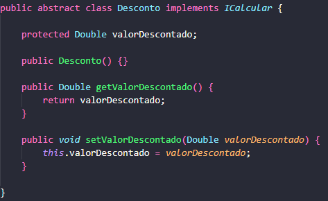
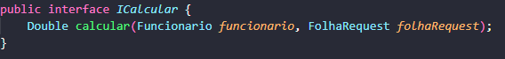
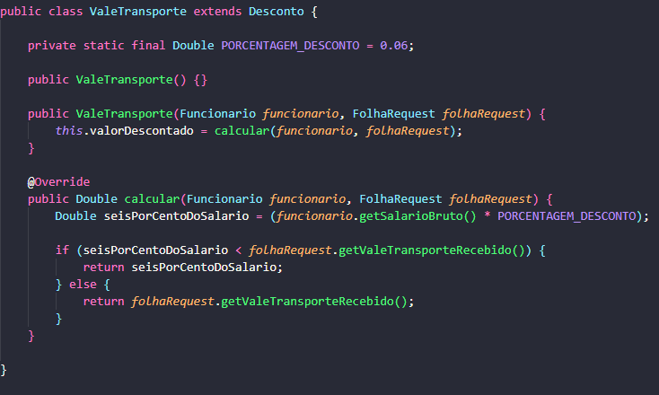

# 💡 Aplicações de Conceitos de Programação Orientada a Objetos

## 🧩 Interfaces e Classes Abstratas

### ⚙️ Interface `ICalcular`

Classe responsável por definir um contrato para a implementação do método Calcular, utilizado para realizar os cálculos de benefícios e descontos. Essa estrutura aplica o conceito de interface, garantindo que todas as classes que a implementem sigam o mesmo padrão de comportamento.

---

### 🧱 Classe Abstrata `Desconto`

A classe abstrata Desconto define uma generalização para todos os benefícios e descontos da folha de pagamento, concentrando os atributos e comportamentos comuns entre eles. Essa abordagem aplica o conceito de classe abstrata, permitindo que as subclasses especializadas herdem e personalizem suas funcionalidades.

---

## 🧬 Herança e Polimorfismo

### 🚍 Classe `ValeTransporte`

Exemplo de classe que herda a abstração definida por Desconto. Como Desconto é uma classe abstrata, a implementação do método de cálculo é realizada pelas subclasses concretas que especificam sua própria lógica.

