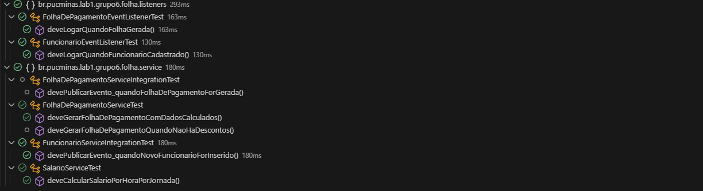
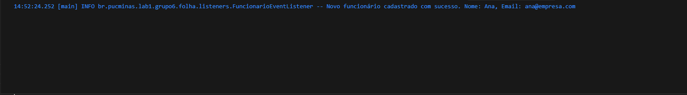

## 🆕 **Implementações Sprint 3**

### 1) Uso de Coleções (List, Set, Map)
Para organização eficiente dos dados:
- `List<Funcionario>` para coleção ordenada de funcionários
- `Set<String>` para evitar repetição de cargos
- `Map<Funcionario, FolhaPagamento>` para vincular colaborador → folha gerada

---

### 2) Processamento com Streams
Streams foram utilizadas para:
- Filtragem de funcionários
- Ordenação por salário/cargo
- Criação de relatórios dinâmicos

**Exemplo:**
```java
var funcionariosAtivos = funcionarios.stream()
    .filter(Funcionario::isAtivo)
    .toList();
```

---

### 3) Persistência em Banco Relacional
Persistência implementada com JPA + Hibernate, permitindo uso de H2, MySQL ou PostgreSQL.

**Exemplo de configuração:**
```java
spring.datasource.url=jdbc:postgresql://localhost:5432/folha
spring.datasource.username=postgres
spring.datasource.password=senha
spring.jpa.hibernate.ddl-auto=update
```

### 4) Implementação de Eventos (Domain Events)

Todos os testes de eventos funcionando corretamente


| Evento                       | Quando dispara              | Ação executada            |
| ---------------------------- | --------------------------- | ------------------------- |
| `FuncionarioCadastradoEvent` | Ao cadastrar funcionário    | Registro de log        
| `FolhaGeradaEvent`           | Ao gerar folha de pagamento | Notificação (console/log) |



### 5) Preparação da Arquitetura para Integração com Frontend
Controladores REST criados e rotas definidas:
| Endpoint                 | Função                        |
| ------------------------ | ----------------------------- |
| `GET /funcionarios`      | Listar funcionários           |
| `POST /funcionarios`     | Cadastrar funcionário         |
| `POST /folha/gerar/{id}` | Gerar folha de um funcionário |
