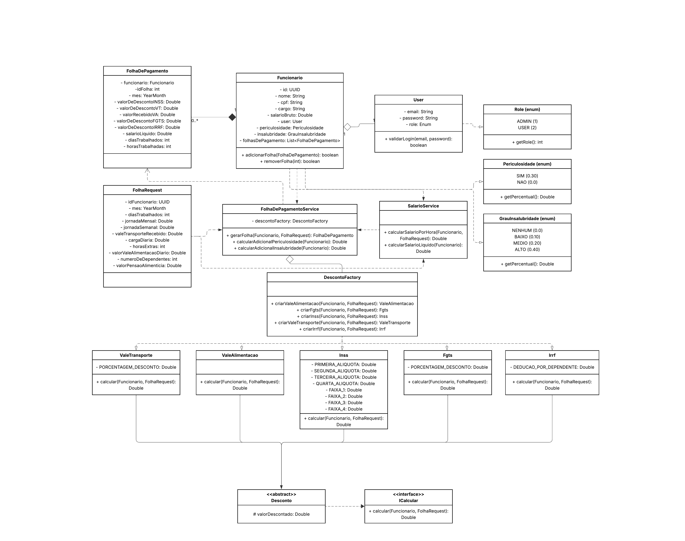

# 🧩 Modelagem do Sistema

## 🧩 Diagrama de Classes UML

---

## 🧾 Cartões CRC

### Funcionario

| **Classe** | `Funcionario` |
|-------------|----------------|
| **Responsabilidades** | - Armazenar dados cadastrais e salariais do colaborador. - Informar salário base, periculosidade e insalubridade. - Calcular salário bruto considerando adicionais. - Manter histórico de folhas de pagamento. |
| **Colaborações** | - `FolhaDePagamento` - `User` - `SalarioService` - `FolhaDePagamentoService`|

### FolhaDePagamento

| **Classe** | `FolhaDePagamento` |
|-------------|--------------------|
| **Responsabilidades** | - Representar a folha mensal de um funcionário. - Consolidar valores de descontos e benefícios (INSS, FGTS, VT, VA, IRRF). - Calcular e armazenar o salário líquido. - Registrar metadados do período (mês, dias e horas trabalhadas). |
| **Colaborações** | - `Funcionario` - `SalarioService` - `FolhaDePagamentoService`|

### User

| **Classe** | `User` |
|-------------|--------|
| **Responsabilidades** | - Representar credenciais do sistema (`email`, `password`). - Controlar permissões de acesso com base em `Role`. - Associar autenticação a um `Funcionario`. |
| **Colaborações** | - `Funcionario` - `Role`|

### FolhaRequest

| **Classe** | `FolhaRequest` |
|-------------|----------------|
| **Responsabilidades** | - Transportar parâmetros de cálculo do período (mês, dias, jornadas, horas extras). - Padronizar a entrada para os serviços de cálculo, evitando parâmetros soltos. - Representar a solicitação de geração da folha. |
| **Colaborações** | - `SalarioService` - `FolhaDePagamentoService`|

### SalarioService

| **Classe** | `SalarioService` |
|-------------|-----------------|
| **Responsabilidades** | - Calcular o salário por hora e adicionais (insalubridade, periculosidade). - Calcular salário líquido com base em proventos e descontos consolidados. - Fornecer valores de base para a geração da folha. |
| **Colaborações** | - `Funcionario` - `FolhaRequest` - `FolhaDePagamentoService`|

### FolhaDePagamentoService

| **Classe** | `FolhaDePagamentoService` |
|-------------|---------------------------|
| **Responsabilidades** | - Orquestrar o processo de geração da folha de pagamento. - Integrar cálculos de descontos e benefícios via `DescontoFactory`. - Consolidar valores finais e instanciar `FolhaDePagamento`. - Centralizar a lógica de fluxo entre serviços e entidades. |
| **Colaborações** | - `Funcionario` - `FolhaRequest` - `DescontoFactory` - `SalarioService` - `ICalcular`|

### DescontoFactory

| **Classe** | `DescontoFactory` |
|-------------|-------------------|
| **Responsabilidades** | - Criação de descontos. - Centralizar a lógica de instanciação de descontos concretos. - Facilitar a manutenção e expansão de novos tipos de desconto. |
| **Colaborações** | - `Desconto` (abstrata) - `FolhaDePagamentoService` - Subclasses de desconto (`Inss`, `Irrf`, `Fgts`, `ValeTransporte`, `ValeAlimentacao`). |

### Desconto

| **Classe** | `Desconto` |
|-------------|------------|
| **Responsabilidades** | - Definir o contrato e a estrutura base para descontos da folha. - Calcular o valor descontado conforme o salário e tipo de benefício. - Ser estendida por classes concretas com regras específicas. |
| **Colaborações** | - `Funcionario` - `FolhaRequest` - `ICalcular`|

### ICalcular

| **Classe** | `ICalcular` |
|-------------|-------------|
| **Responsabilidades** | - Definir o contrato comum para todos os cálculos de desconto ou benefício. - Garantir que todas as subclasses implementem `calcular()`. - Promover padronização entre as implementações concretas. |
| **Colaborações** | - `Desconto` - `FolhaDePagamentoService`|

### Descontos Concretos

| **Classe** | `Inss` / `Irrf` / `Fgts` / `ValeTransporte` / `ValeAlimentacao` |
|-------------|-----------------------------------------------------------------|
| **Responsabilidades** | - Implementar o cálculo de um tipo específico de desconto ou benefício. - Aplicar regras legais ou empresariais (percentuais, limites e faixas). - Retornar o valor a ser descontado ou adicionado. |
| **Colaborações** | - `DescontoFactory` - `Funcionario` - `FolhaRequest` - `ICalcular`|