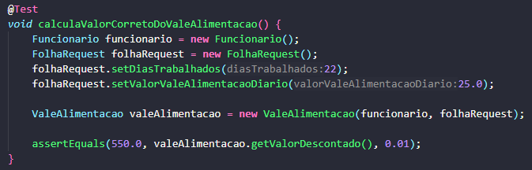
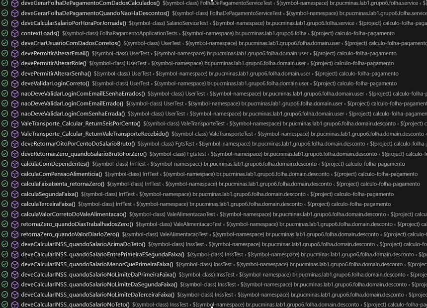

# 🧪 Testes

Este documento apresenta o **planejamento**, a **implementação** e a **execução dos testes automatizados** realizados no sistema de Folha de Pagamento.

---

## 📘 Planejamento de Testes

O planejamento detalhado dos testes se encontra no seguinte arquivo: [PlanejamentoTestes.pdf](./assets/modelagem/Planejamento-Testes.pdf)

---

## ⚙️ Implementação dos Testes

### 🧩 Exemplo de Teste Unitário Implementado

---

### 🚀 Execução dos Testes

